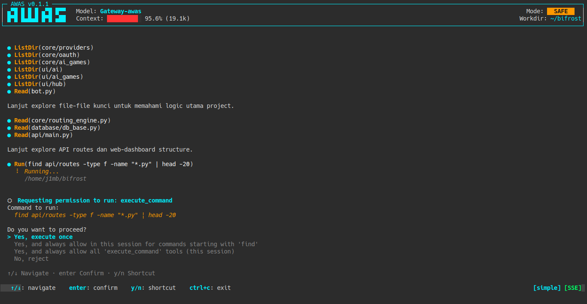
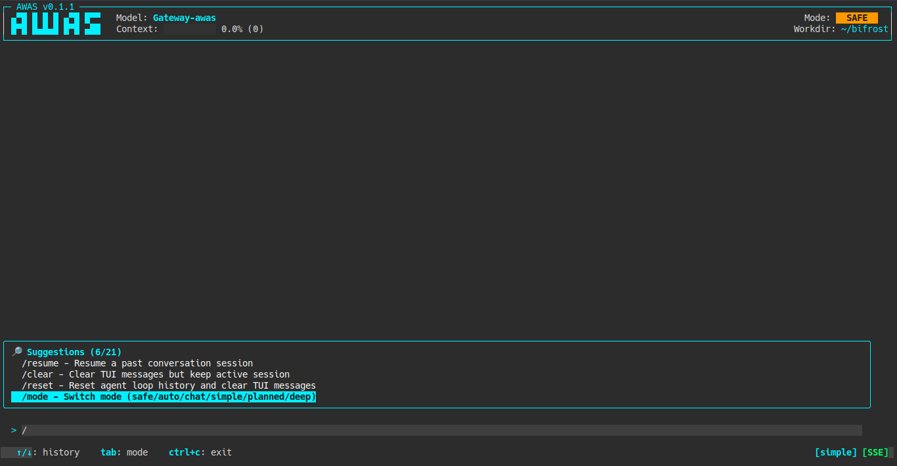
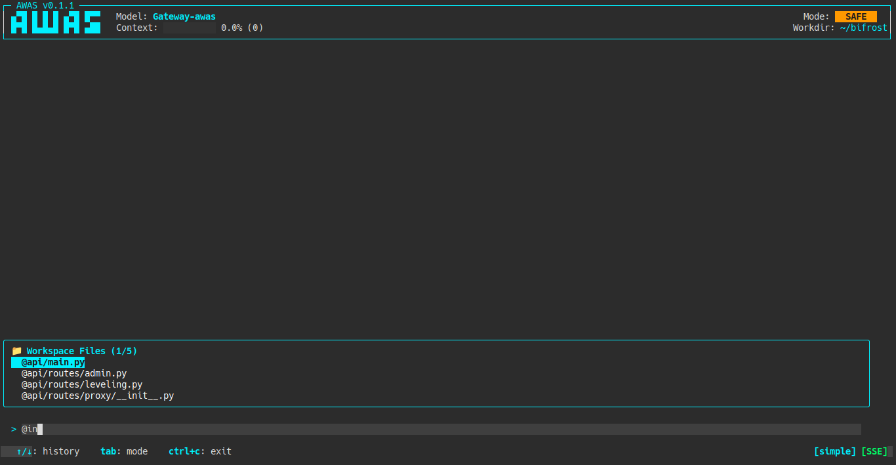

# AWAS AGENT


[](https://www.npmjs.com/package/awas-ai)
[](https://www.npmjs.com/package/awas-ai)
[](https://go.dev)
[](#os-specific-configuration-directory-paths)
[](#gateway-commands-telegram--discord)
[](LICENSE)
[](https://saweria.co/dimasla)



**AWAS** is an terminal-based AI assistant and multi-platform gateway daemon (telegram & discord). It empowers developers to write code, inspect codebases, execute terminal commands, manage persistent memories, and automate workflows safely through an interactive Terminal UI (TUI) or remotely via Telegram and Discord gateway bots.

---

## Interface Preview

| Interactive Pairing & Tool Approval | Slash Command Autocomplete | Workspace File @Mention |
| :---: | :---: | :---: |
|  |  |  |

---

## Key Features

* **Dual Interface**: Interactive Terminal UI (TUI) or background Multi-Platform Gateway Daemon (Telegram & Discord).
* **Cross-Platform**: Fully supported on **Windows**, **macOS**, and **Linux**.
* **4 Reasoning Agent Modes**:
  * `chat`: Conversational assistant for general queries, web research, and system tools.
  * `simple`: Fast ReAct cycle executing single tool steps.
  * `planned`: Generates a structured multi-step plan before execution.
  * `deep`: Advanced planning with self-reflection, parameter adjustment, and automated retry strategies.
* **Safety & Autonomy Controls**:
  * `safe`: Interactive approval prompts for actions modifying files or executing shell commands.
  * `autonomous`: Fully autonomous execution with configurable chain limits (`max_chain_limit`).
* **Persistent Memory System**:
  * Automatically records user preferences (`USER.md`) and environment conventions (`MEMORY.md`).
  * First-turn & periodic system nudges ensure memories stay updated organically.
  * Smart context compression prevents token bloat.
* **Custom Skills Engine**: Load custom markdown guidelines from `.awas/skills/*.md` to enforce coding styles and workflows.
* **Cron & Task Scheduler**: One-shot timers or recurring cron jobs (`/cron`) managed in the background.
* **Multi-Tenant Gateway**:
  * Background daemon for Telegram & Discord bots.
  * Per-user isolated SQLite session persistence (`.awas/sessions/`).
  * Inline interactive approval buttons and slash command controls (`/reset`, `/status`, `/mode`, `/cron`, `/yes`, `/no`).
  * Security user allowlists (`allowed_users`) to restrict access.

---

## OS-Specific Configuration Directory Paths

AWAS stores configuration files, provider profiles, sessions, and memory in the `.awas` directory under your user home folder:

| OS | Config Directory Path |
| :--- | :--- |
| **Windows** (CMD / PowerShell) | `%USERPROFILE%\.awas\` *(e.g., `C:\Users\YourName\.awas\config.json`)* |
| **macOS** | `~/.awas/` *(e.g., `/Users/YourName/.awas/config.json`)* |
| **Linux** | `~/.awas/` *(e.g., `/home/YourName/.awas/config.json`)* |

---

## Installation

### 1. NPM (Recommended for Windows, macOS & Linux)

Install globally (requires Node.js 18+):

```bash
# Windows (PowerShell / CMD) or macOS / Linux Terminal:
npm install -g awas-agent@latest
```

### 2. Curl (Linux & macOS)

Install pre-compiled binary via curl shell installer:

```bash
curl -fsSL https://raw.githubusercontent.com/jimbon25/awas-agent/main/install.sh | bash
```

### 3. Build From Source (Go 1.22+)

```bash
# Clone repository
git clone https://github.com/jimbon25/awas-agent.git
cd awas-agent

# Build binary
# Linux / macOS:
go build -o awas main.go
sudo mv awas /usr/local/bin/

# Windows (PowerShell):
go build -o awas.exe main.go
```

---

## Usage & CLI Commands

### Start Interactive TUI

Launch the interactive terminal interface in your current project directory:

```bash
# Windows / macOS / Linux:
awas
```

### Gateway Commands (Telegram & Discord Bots)

AWAS natively supports installing, status checking, and stopping the Gateway daemon as a background service across all major operating systems:

* **Linux**: Managed via `systemd` user service (`~/.config/systemd/user/awas-gateway.service`).
* **macOS**: Managed natively via `launchd` LaunchAgent (`~/Library/LaunchAgents/com.awas.gateway.plist`).
* **Windows**: Managed natively via Windows Task Scheduler (`schtasks` with logon auto-start trigger).

```bash
# Install and start Gateway daemon as a background service (Linux / macOS / Windows)
awas gateway start

# Check operational status of the Gateway daemon service
awas gateway status

# Stop and uninstall the background Gateway daemon service
awas gateway stop

# Run Gateway daemon directly in terminal foreground (for debugging)
awas gateway run
```

---

## Configuration Files Setup

All configuration files are created automatically inside your `.awas` configuration directory on first run.

### 1. Main Configuration (`config.json`)

**Location**:
* Windows: `%USERPROFILE%\.awas\config.json`
* macOS / Linux: `~/.awas/config.json`

```json
{
  "endpoint": "http://localhost:12345/v1",
  "model": "Custom-model",
  "api_key": "YOUR_API_KEY_IF_REQUIRED",
  "mode": "safe",
  "max_chain_limit": 0,
  "max_tokens": 20000,
  "stream": true,
  "agent_mode": "simple",
  "max_retries": 3,
  "require_plan_approval": true,
  "keep_last_turns": 5,
  "searxng_url": "http://localhost:8888",
  "memory_enabled": true,
  "user_profile_enabled": true,
  "memory_char_limit": 2200,
  "user_char_limit": 1375,
  "nudge_interval": 10
}
```

#### Configuration Field Details

| Field | Type | Default | Description |
| :--- | :--- | :--- | :--- |
| `endpoint` | `string` | *Required* | OpenAPI-compatible endpoint URL (e.g. OpenRouter, OpenAI, Local Gateway). |
| `model` | `string` | *Required* | Active LLM model name (e.g. `claude-3-5-sonnet`, `gemini-1.5-pro`, `Custom-model`). |
| `api_key` | `string` | `""` | API key (optional for local endpoints). |
| `mode` | `string` | `"safe"` | `safe` (asks approval for modifications) or `autonomous` (auto-executes). |
| `max_chain_limit` | `int` | `0` | Consecutive tool call limit before prompting user (`0` = unlimited). |
| `max_tokens` | `int` | `20000` | Token limit triggering smart context compression (`0` = unlimited). |
| `stream` | `bool` | `true` | Enable SSE streaming responses. |
| `agent_mode` | `string` | `"simple"` | `chat`, `simple`, `planned`, or `deep`. |
| `max_retries` | `int` | `3` | Maximum tool retry attempts in `deep` mode. |
| `require_plan_approval`| `bool` | `true` | Ask for plan confirmation before execution in `planned` mode. |
| `keep_last_turns` | `int` | `5` | Turns kept uncompressed during context pruning. |
| `searxng_url` | `string` | `""` | Optional SearXNG instance URL for local web search. |
| `memory_enabled` | `bool` | `true` | Enable persistent system memory (`MEMORY.md`). |
| `user_profile_enabled` | `bool` | `true` | Enable persistent user profile (`USER.md`). |
| `memory_char_limit` | `int` | `2200` | Max character budget for system memory context. |
| `user_char_limit` | `int` | `1375` | Max character budget for user profile context. |
| `nudge_interval` | `int` | `10` | Frequency (in conversation turns) to remind agent to update memory. |

---

### 2. Gateway Configuration (`gateways.json`)

**Location**:
* Windows: `%USERPROFILE%\.awas\gateways.json`
* macOS / Linux: `~/.awas/gateways.json`

```json
{
  "enabled": true,
  "platforms": {
    "telegram": {
      "type": "telegram",
      "enabled": true,
      "token": "YOUR_TELEGRAM_BOT_TOKEN",
      "allowed_users": ["123456789"],
      "max_users": 5
    },
    "discord": {
      "type": "discord",
      "enabled": true,
      "token": "YOUR_DISCORD_BOT_TOKEN",
      "app_id": "YOUR_DISCORD_APP_ID",
      "allowed_users": ["987654321"],
      "max_users": 5,
      "extra": {
        "guild_id": "YOUR_GUILD_ID"
      }
    }
  }
}
```

#### Gateway Field Details

| Field | Description |
| :--- | :--- |
| `enabled` | Master toggle to enable/disable gateway server. |
| `token` | Telegram / Discord Bot Token from BotFather or Discord Developer Portal. |
| `allowed_users` | List of allowed User IDs or Chat IDs (`[]` = allow all users). |
| `max_users` | Maximum concurrent active user sessions (`0` = unlimited). |

---

### 3. Provider Profiles (`providers.json`)

**Location**:
* Windows: `%USERPROFILE%\.awas\providers.json`
* macOS / Linux: `~/.awas/providers.json`

```json
{
  "active_profile": "custom_endpoint",
  "profiles": {
    "custom_endpoint": {
      "name": "custom",
      "endpoint": "http://localhost:12345/v1",
      "api_key": "",
      "model": "Custom-model"
    }
  }
}
```

---

### 4. Environment Variable Overrides

You can override any configuration setting using environment variables across PowerShell, CMD, or Bash:

| Variable | Description |
| :--- | :--- |
| `AWAS_ENDPOINT` | API Endpoint URL |
| `AWAS_MODEL` | Target Model |
| `AWAS_API_KEY` | API Secret Key |
| `AWAS_WORKDIR` | Working Directory Path |
| `AWAS_MODE` | Execution Mode (`safe` \| `autonomous`) |
| `AWAS_AGENT_MODE` | Reasoning Mode (`chat` \| `simple` \| `planned` \| `deep`) |
| `AWAS_MAX_CHAIN_LIMIT`| Consecutive tool limit |
| `AWAS_MAX_TOKENS` | Max tokens limit |
| `AWAS_STREAM` | `true` or `false` |

---

## Slash Commands

### Terminal UI (TUI) Commands

Use these commands in the interactive TUI prompt:

| Command | Description |
| :--- | :--- |
| `/help` | Show interactive help menu with all keyboard shortcuts and commands. |
| `/reset` | Reset current conversation history. |
| `/clear` | Clear screen buffer. |
| `/mode [chat\|simple\|planned\|deep]` | Switch agent reasoning mode (`chat`, `simple`, `planned`, `deep`). |
| `/model [model-name]` | View or switch active LLM model. |
| `/switch` | Switch between configured provider profiles. |
| `/stream` | Toggle SSE response streaming on or off. |
| `/tokens` | Display token usage and context metrics. |
| `/limit [number]` | Set consecutive tool call limit (`0` = unlimited). |
| `/undo` / `/redo` | Undo or redo file edits performed by the agent. |
| `/undo-history` | View list of file modification checkpoints. |
| `/history` / `/resume` | Save or resume session history from disk. |
| `/skills` | List or manage local skill guidelines stored in `.awas/skills/`. |
| `/indexing` | Build or refresh local workspace project index. |
| `/gateway` | View gateway daemon status. |
| `/setup` | Rerun configuration wizard. |
| `/exit` / `/quit` | Exit the TUI application. |

---

### Gateway Commands (Telegram & Discord)

Use these commands in Telegram or Discord chats:

| Command | Description |
| :--- | :--- |
| `/start` | Show welcome message and command overview. |
| `/reset` | Completely wipe active session history and delete SQLite session file from disk. |
| `/status` | View session status, active model, mode, token count, workdir, and turn stats. |
| `/mode [chat\|simple\|planned\|deep]` | Switch active reasoning agent mode for the chat session. |
| `/cron` | View, add, or delete scheduled background cron jobs. |
| `/yes` / `/no` | Approve or reject pending tool execution in Telegram/Discord. |
| `/continue` / `/stop` | Continue or abort long-running tool execution chains. |

---

## Support & Donation

If you find AWAS helpful in your daily workflow, consider supporting the project:

[](https://saweria.co/dimasla)

---

## License

This project is licensed under the **MIT License**.